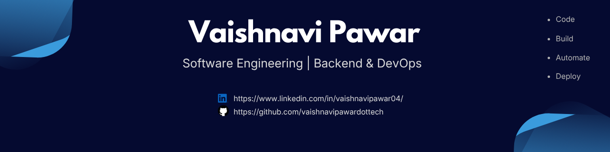

  

---

🌱 **About Me**
- 🎓 B-tech in Computer Engineering from VIIT, Pune (2022-2026)
- 💼 Completed an 8-month Software Engineering Internship at Vistora AI
- ⚙️ Skilled in Java, Spring Boot, JavaScript, Linux, Git, Docker, CI/CD, GitHub Actions, Jenkins, Kubernetes and AWS interested in Containerization, Automation, and Cloud Infrastructure
- 🎯 Actively seeking entry-level opportunity in Backend, DevOps and Cloud

---

### 🧰 Tools & Technologies

<b>Languages</b>
 

<b>Frameworks & Libraries</b>
 

<b> Linux & Scripting</b>
 

<b> Version Control</b>
 

<b> Containers & Orchestration</b>
 

<b> CI/CD & GitOps</b>
 

<b> Cloud</b>
 

<b> DevSecOps</b>
 

---

👉 **Let's Connect!**

- 🔗 [LinkedIn](https://www.linkedin.com/in/vaishnavipawar04/)
- 💻 [GitHub](https://github.com/vaishnavipawardottech)
- 📧 pawarvaishnavi.3010@gmail.com  

---
